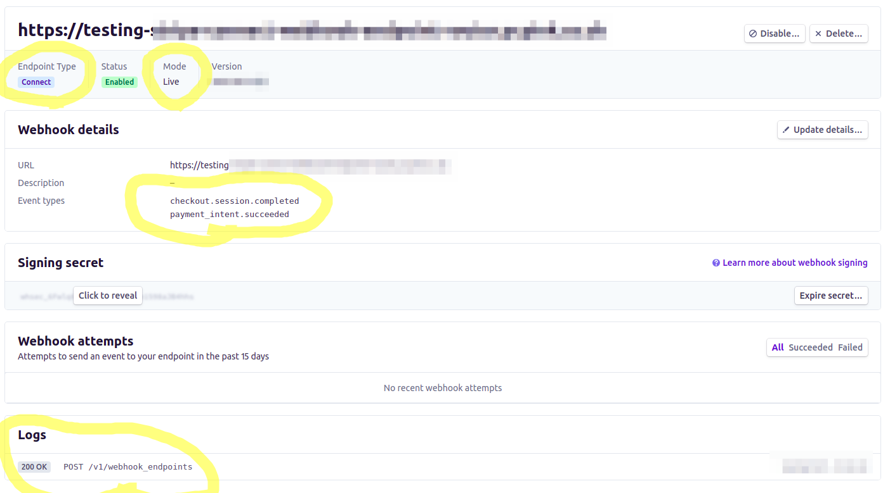

# Recieve connect webhooks from Stripe & forward them to the correct shop

### What does this do?

When events happen at Stripe (e.g. a user completes a payment),
Then, if you have configured webhook endpoint in Stripe) will send 
*the events you ask for*, to you webhook endpoint.


### Local Install

```
virtualenv venv
. venv/bin/activate
pip install -r requirements.txt
``` 

## Configure

```
cp .env.example .env
```
## Run (locally)

```
export FLASK_APP=main.py
export FLASK_DEBUG=1
flask run
```

## Deploy

See apache example config & wsgi config example in repo. (assumes mod wsgi is installed & enabled on apache)

### Create webhook endpoints in Stripe

1. Check the webhook is *not* already created https://dashboard.stripe.com/webhooks (do you already see the endpoint?)
   There should be two, one endpoint for connect accounts in testmode, and one for test accounts in live mode.

e.g. my-api-live.example.com/stripe_webhooks and my-api-test.example.com/stripe_webhooks

> Note: Stripe livemode is *always* true for Stripe connect. Why?
  Because Stripe connect accounts can either be in live or test mode so
  the live/test mode config is moved to each Stipe connect account (and
  they can change their account to be in live or test mode).


2. If not, create it:

  Use `create_stripe_connect_webhook.py` in this repo:

  ```
  . venv/bin/activate
  python create_stripe_connect_webhook.py
  Stripe secret api key:sk_live_abc123
  Webhook url:https://testing-example.com
  {
    "api_version": null,
    "application": "ca_",
    "created": ,
    "description": null,
    "enabled_events": [
      "checkout.session.completed",
      "payment_intent.succeeded"
    ],
    "id": "we_",
    "livemode": true,
    "metadata": {},
    "object": "webhook_endpoint",
    "secret": "whsec_ndisofndio23iono",
    "status": "enabled",
    "url": "https://testing-example.com"
  }

  ```
3. Copy the `secret` from the output, this app needs the secret to verify the events come from Stripe.
4. Set the dokku app secret:
   ```
   dokku config:set testing-stripe-connect-webhook-endpoint-router STRIPE_WEBHOOK_SECRET=<secret>
   ```
  

### 

It it not possible or desireable to create Stripe webhooks endpoints in 'test mode' using the UI, they are all live by default. We must use the api for that.

https://testing-stripe-connect-webhook-endpoint-router.pcpink.co.uk


- test mode, is where all shops in test mode Stripe sends events to *including* our GithubAction playwright tests , they are in test mode too


Event types
checkout.session.completed
payment_intent.succeeded

Mode


Signing secret


## Smoke test

```
curl -H 'Content-Type: application/json' -d '{"account":"-1"}' <host> | grep "No site_url for that account id"
```

## Debug / Local development

Listen for webhooks using stripe cli (forwarding to *this* app)
Also, on another port, run a shop locally on another port (e.g. flask run --port 5001)
Then start the checkout process to generate events.

Listen locally to only the events which need to be processed using stripe cli:
```
stripe listen --events checkout.session.completed,payment_intent.succeeded --forward-to 127.0.0.1:5001
```
